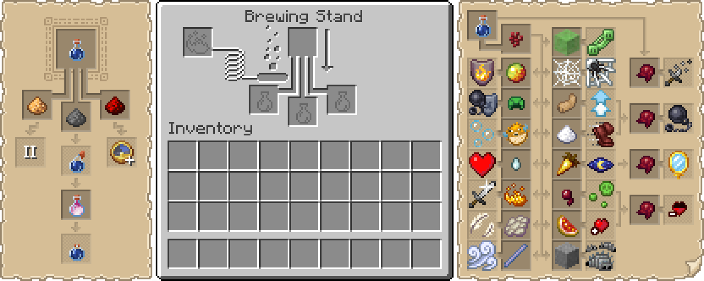

# Brewing Guide
Minecraft Brewing Guide Resource Pack


# Source Files
#### Photoshop (PSD) Files
Photoshop source files for modifying the recipes and effects shown within the Brewing Stand GUI.
Linked PSB files are used within the main PSD to update all elements at once.
```py
src/
└─ brewing_guide.psd
└─ linked/
      ├─ effect_slot.psb
      ├─ slot.psb
      ├─ horizontal_arrow.psb
      ├─ horizontal_join_flipped.psb
      ├─ horizontal_join.psb
      └─ horizontal_merge_2to1_arrow.psb
```
#### Scripts
These scripts are used to maintain the pack across various Minecraft versions by keeping all language files up-to-date with the current version.
```py
scripts/
├─ download_lang_codes.js
    # Script to be run on https://minecraft.wiki/w/Language 
    # Used to download the "language.json" file
├─ generate_lang_files.py
    # Once you have run the JS script to aquire a "language.json" file,
    # You can use this script to generate other language files 
    # Uses the "en_us.json" from the resource pack to create all other language files
└─ language.json
    # The file downloaded using the JS script should be placed here
```

# Download
To download the release of the pack, you can grab it from either source:
- [CurseForge](https://legacy.curseforge.com/minecraft/texture-packs/in-game-brewing-guide)
- [Modrinth](https://modrinth.com/resourcepack/in-game-brewing-guide)