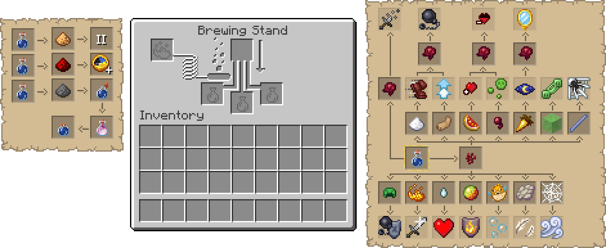

# Brewing Guide
Minecraft Brewing Guide Resource Pack


# Source Files
#### Photoshop (PSD) Files
Photoshop source files for modifying the recipes and effects shown within the Brewing Stand GUI.
```py
assets/
└─ minecraft/
   └─ textures/
      └─ gui/
         └─ container/
            ├─ brewing_guide_left.psd
            └─ brewing_guide_right.psd
```
#### Scripts
These scripts are used to maintain the pack across various Minecraft versions by keeping all language files up-to-date with the current version.
```py
scripts/
├─ download_lang_codes.js
    # Script to be run on https://minecraft.wiki/w/Language 
    # Used to download the "language.json" file
├─ generate_lang_files.py
    # Once you have run the JS script to aquire a "language.json" file,
    # You can use this script to generate other language files 
    # Uses the "en_us.json" from the resource pack to create all other language files
└─ language.json
    # The file downloaded using the JS script should be placed here
```

# Download
To download the release of the pack, you can grab it from either source:
- [CurseForge](https://legacy.curseforge.com/minecraft/texture-packs/in-game-brewing-guide)
- [Modrinth](https://modrinth.com/resourcepack/in-game-brewing-guide)